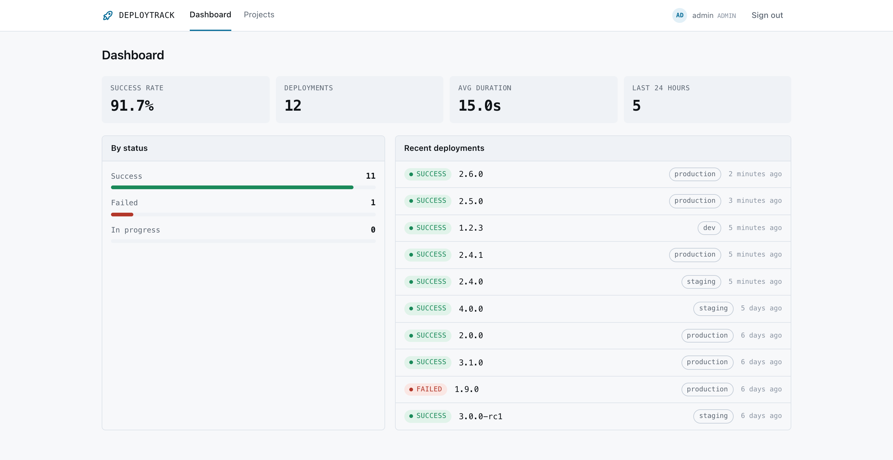
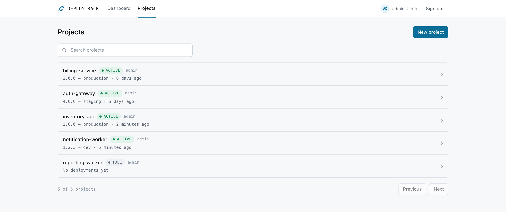
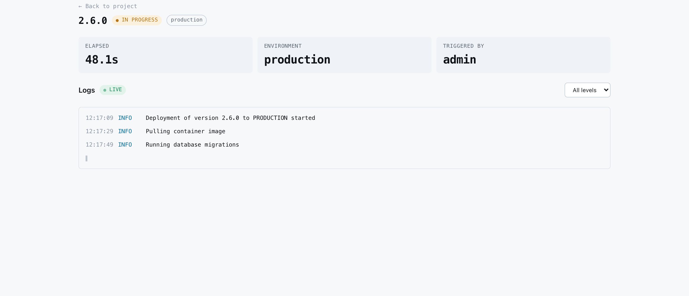

# DeployTrack

Track application deployments across environments, and watch their logs stream in live as they run.

Built as a portfolio project to work end to end the way a small team would build it: a REST API with role and ownership-based access control, a React front end, real integration tests against PostgreSQL, CI gating a protected branch, and infrastructure defined as code.



## Try it

Requires Docker. Nothing else — no JDK, Node, or Maven.

```bash
docker compose up -d --build
```

Open <http://localhost:3000> and click **Continue to the demo** for a read-only workspace with sample deployment history.

To sign in with write access instead, use `admin@deploytrack.dev` with the password you set in `ADMIN_PASSWORD` (see [First admin](#first-admin)).

## What it does

A **project** is one deployable application. Each project has **deployments** — a version shipped to `dev`, `staging` or `production` — and each deployment writes **logs**.



A project's status is derived from its most recent deployment rather than stored, so it can never drift out of sync with what actually happened:

| Status | Meaning |
|---|---|
| `IDLE` | Never deployed |
| `DEPLOYING` | A deployment is running now |
| `ACTIVE` | The last deployment succeeded |
| `FAILING` | The last deployment failed |

### Deployments are asynchronous

Real deployments take minutes, and no HTTP connection should be held open that long. Triggering one returns **`202 Accepted`**, not `201 Created` — the record exists, the work does not.

`IN_PROGRESS` is the only non-terminal state, and terminal states are final. The rules live on the status enum rather than scattered through the service, so a retried CI callback cannot flip a `FAILED` deployment to `SUCCESS`. Only one deployment may run per project and environment at a time, since two would make the history unable to say what is actually live.

### Logs stream live



While a deployment runs, log lines arrive over Server-Sent Events. The live indicator matters: a list that quietly updates is visually identical to a stale page.

Events are published only **after** the writing transaction commits, so a rolled-back transaction can never surface a log line that later vanishes.

## Design decisions worth explaining

**SSE consumed with `fetch`, not `EventSource`.** `EventSource` is the obvious API for server-sent events, but it cannot set request headers, so it cannot send `Authorization: Bearer`. The usual workaround puts the token in the query string, where it lands in server access logs, browser history and referrer headers. Parsing the wire format by hand and reimplementing backoff was the better side of that trade.

**Role and ownership are separate checks.** Roles answer "what kind of user are you"; ownership answers "is this record yours". Enforcing only the first is how IDOR vulnerabilities happen — a valid `DEVELOPER` token plus someone else's project id. Visibility scoping sits in front of both: a developer sees only their own projects, in the list, in the dashboard figures, and by direct id.

Requests outside a caller's visibility return **404, not 403**, because a 403 confirms the record exists.

**Aggregates are computed in SQL.** Loading rows to count them in Java behaves identically against three rows and collapses at scale. Listing projects with their latest deployment uses one batched query rather than one per project; [a test asserts on Hibernate's statement count](backend/src/test/java/com/deploytrack/service/ProjectListQueryCountIT.java), because a test asserting on the returned data would pass either way.

**`null` is not zero.** Success rate and average duration are genuinely unknown until a deployment settles, and render as "No data yet". Showing `0%` would tell a new user everything is failing.

**Flyway owns the schema, Hibernate validates it.** `ddl-auto` is `validate`, never `update`: migrations change the schema, and Hibernate refuses to start if the entities have drifted from it. Foreign keys are indexed by hand, since Postgres does not do it automatically and every deployment and log query filters on exactly those columns.

## Architecture

```
Browser ──▶ Nginx ──▶ Spring Boot API ──▶ PostgreSQL
             │  serves the built React app
             └─ proxies /api to the backend
```

Nginx proxying `/api` makes production same-origin, which is why no CORS configuration exists anywhere in this project. The Vite dev server proxies identically, so neither environment has a cross-origin split to work around.

- **Backend** — Java 21, Spring Boot 3, Spring Security with JWT, Spring Data JPA, Flyway, PostgreSQL
- **Frontend** — React 19, TypeScript, Tailwind CSS 4, Vite
- **Infrastructure** — Docker multi-stage builds, Nginx, GitHub Actions, Terraform for AWS

## Testing

91 tests. `mvn test` runs the fast unit tests with no Docker; `mvn verify` adds the integration tests.

```bash
cd backend && mvn verify
```

Integration tests run against a **real PostgreSQL container** via Testcontainers rather than an in-memory substitute — a different database means a different dialect and different constraint behaviour, so H2 tests can pass while production breaks.

A few of them exist because of specific bugs that reached a running application:

- Deleting a project with deployments failed, because the original migration declared foreign keys with no `ON DELETE` action. Every existing delete test passed, because they all deleted empty projects.
- Listing projects without a search term failed with `function lower(bytea) does not exist`, because a null string parameter has no type Postgres can infer. Every list test happened to pass a search term.
- The deployment simulator runs on a thread with no security context, so a per-user check on the path to completing a deployment stranded every one of them. No test caught it because every integration test disabled the simulator; [one now runs with it enabled](backend/src/test/java/com/deploytrack/service/DeploymentSimulatorIT.java).

The pattern in all three: the tests covered the shapes that were easy to set up, not the ones the application actually runs.

## Continuous integration

Every pull request runs [the CI workflow](.github/workflows/ci.yml) — backend tests, a frontend typecheck and build, and both Docker image builds. `main` requires all three to pass before a pull request can merge, so it stays deployable.

## Deploying

Infrastructure for AWS is defined in [terraform/](terraform/): a single EC2 instance running both containers against managed RDS PostgreSQL, with the database in a private subnet reachable only from the application's security group.

Neither the instance nor GitHub Actions stores AWS credentials — the instance uses an IAM role and CI authenticates through OIDC, so every credential is temporary and rotates automatically. No NAT gateway or load balancer is created; at this scale each would cost more per month than everything else combined.

[docs/deployment.md](docs/deployment.md) is the full runbook, including billing alerts and teardown.

## Developing

The containerised stack above is how the app runs in production. While developing, run only the database in Docker and the two halves natively, for hot reload. Requires JDK 21, Maven and Node.

```bash
docker compose up -d postgres
```

```bash
cd backend && ADMIN_EMAIL=admin@deploytrack.dev ADMIN_PASSWORD=pick-a-password DEMO_ENABLED=true DEMO_PASSWORD=demo-readonly mvn spring-boot:run
```

```bash
cd frontend && npm install && npm run dev
```

The API is on <http://localhost:8080> and the app on <http://localhost:5173>. Postgres uses host port `5433` so it does not collide with a locally installed PostgreSQL.

This project targets Java 21. If `mvn -version` reports a different version, point `JAVA_HOME` at your JDK 21 install first.

### Authentication

Register, then log in to receive a signed JWT, which the client sends as `Authorization: Bearer <token>` on every request.

Self-registration always assigns the `DEVELOPER` role — a client cannot choose its own role, so nobody can register themselves as an admin.

Tokens expire after 15 minutes. Refresh tokens are deliberately out of scope, so a session simply ends; the front end handles that as a routine case rather than an error, since it happens often.

The signing key in `application.yml` is a development default and is public, because this repository is public. That is only safe because it never leaves a developer machine: running with `SPRING_PROFILES_ACTIVE=prod` requires `JWT_SECRET` and the database credentials to be supplied explicitly, and the application refuses to start without them rather than falling back to a known key.

Token storage in the browser is `localStorage`, chosen knowingly. Any script on the page can read it, so one XSS hole leaks the session. The secure alternative is an `httpOnly` cookie, which would require the backend to set and read cookies and to re-enable the CSRF protection this header-based API deliberately drops.

### First admin

Because nobody can self-register as an `ADMIN`, the first one is created on startup from environment variables, and only when no admin exists yet. Leave them unset and the application logs a warning rather than creating an account with a predictable password. Once an admin exists this never runs again, so restarting cannot reset or overwrite it.

### Database migrations

The schema is owned by Flyway. Migrations live in [backend/src/main/resources/db/migration](backend/src/main/resources/db/migration) and are applied on startup, in order, exactly once. To change the schema, add a new file — never edit one that has already run, since Flyway checksums each applied migration and refuses to start if one changes underneath it.

## Known limitations

Documented rather than hidden, because each was a deliberate trade:

- **The SSE subscriber registry is in-memory**, so a stream only receives logs written by the instance it is connected to. Running several instances behind a load balancer would need a shared broker such as Redis pub/sub.
- **No refresh tokens.** A 15-minute session simply ends.
- **No user management endpoints.** Promoting someone to `ADMIN` is a database operation.
- **Deployments are simulated.** A built-in simulator advances them to a terminal state so the application demonstrates end to end; a real pipeline would report outcomes through `PATCH /api/deployments/{id}/status`, which already exists and is the same code path.

## Project layout

```
backend/     Spring Boot API — controller → service → repository → entity
frontend/    React app
terraform/   AWS infrastructure
docs/        Requirements, OpenAPI contract, deployment runbook, design brief
```
